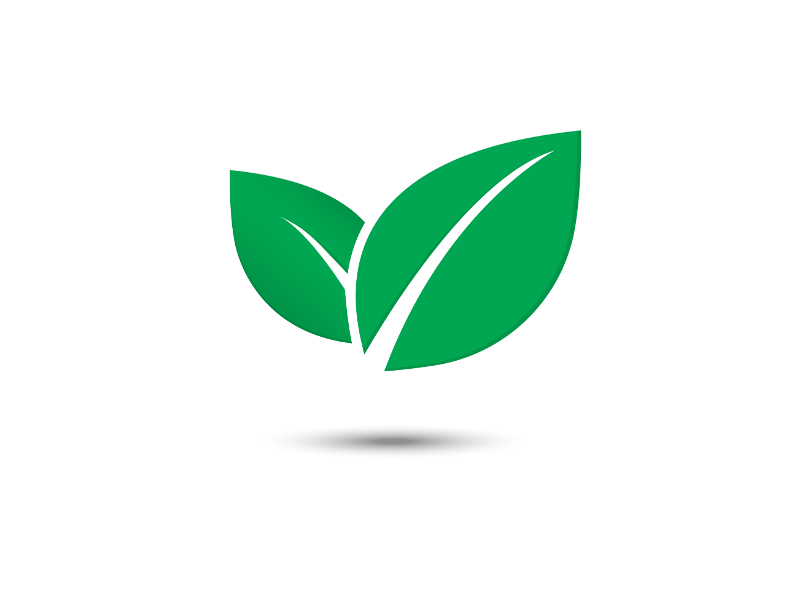

# Food Waste Predictor



## 🌱 Project Overview

Food Waste Predictor is an AI-powered application designed to help restaurants and food businesses reduce waste, cut costs, and minimize environmental impact. By leveraging advanced machine learning algorithms, the system predicts potential food waste based on various factors and provides actionable recommendations to optimize inventory management.

## 🚀 Key Features

### 🔮 Predictive Analytics

- **91% Prediction Accuracy**: Our model achieves 91% accuracy in predicting food waste quantities
- **Multi-factor Analysis**: Considers food type, storage conditions, guest count, event type, and more
- **Real-time Predictions**: Get instant waste predictions based on your input parameters

### 🌍 Environmental Impact Visualization

- **CO2 Emissions Tracking**: Visualize the carbon footprint of food waste
- **Water Footprint Analysis**: Breakdown of blue, green, and grey water usage
- **Environmental Savings Potential**: Interactive waterfall chart showing potential savings
- **Utilization Rate Gauge**: Visual representation of resource efficiency

### 💰 Financial Impact Dashboard

- **ROI Analysis**: Interactive 5-year ROI projection (up to 780%)
- **Cost Breakdown**: Detailed pie chart showing distribution of waste-related expenses
- **Monthly Savings Projection**: Compare current vs. optimized costs
- **24-Month Financial Forecast**: Visualize how savings compound over time
- **Seasonal Waste Pattern Analysis**: Identify high-waste periods throughout the year
- **Investment Scenario Analysis**: Compare different investment options with payback periods

### 🤖 AI-Powered Recommendations

- **Customized Suggestions**: Tailored recommendations based on your specific waste patterns
- **Implementation Timeline**: Prioritized action items with implementation timeframes
- **Impact Ratings**: Each recommendation includes potential waste reduction percentage

## 🔧 Technical Architecture

### Backend (FastAPI)

- **High-Performance API**: Built with FastAPI for fast, asynchronous processing
- **Rate Limiting**: Protects against API abuse with intelligent rate limiting
- **Model Integration**: Seamless integration with our ML model
- **OpenAI Integration**: Generates intelligent, context-aware recommendations

### Data Science & ML

- **Advanced Model**: Random Forest Regressor with feature importance analysis
- **Feature Engineering**: Sophisticated preprocessing pipeline including:
  - Shelf life data extraction
  - Food category standardization
  - Weather data integration
  - Utilization rate calculations
- **Model Performance**: Mean Absolute Error of 0.04
- **Top Predictors**: Utilization Rate (78%), Quantity of Food (8%), Number of Guests (5%)

### Frontend (Next.js)

- **Modern UI**: Clean, responsive design built with Next.js and Tailwind CSS
- **Interactive Visualizations**: Powered by Recharts for dynamic data representation
- **Animated Components**: Smooth transitions and animations via Framer Motion
- **Tab-based Interface**: Organized into Waste Metrics, AI Suggestions, and Financial Impact

## 📊 Data Sources

- Restaurant waste data from multiple establishments
- Brooklyn food waste statistics
- Product shelf life database
- Weather data integration

## 🛠️ Installation & Setup

1. Clone the repository:

   ```bash
   git clone https://github.com/yourusername/food-waste-predictor.git
   cd food-waste-predictor
   ```

2. Create and set up environment variables:

   ```bash
   cp .env.example .env
   # Edit .env with your API keys
   ```

3. Backend setup:

   ```bash
   cd backend
   python -m venv venv
   source venv/bin/activate  # On Windows: venv\Scripts\activate
   pip install -r requirements.txt
   uvicorn app.main:app --reload
   ```

4. Frontend setup:

   ```bash
   cd frontend
   npm install
   npm run dev
   ```

5. Access the application:
   - Frontend: http://localhost:3000
   - API: http://localhost:8000/docs

## 🏆 Impact Potential

- **Financial**: Average ROI of 280% in the first year
- **Environmental**: Potential to reduce CO2 emissions by up to 2.5kg per kg of food saved
- **Operational**: Payback period of approximately 3 months for implementation costs

## 📝 License

This project is licensed under the MIT License - see the LICENSE file for details.

---

_Food Waste Predictor - Turning waste into savings, one prediction at a time._
